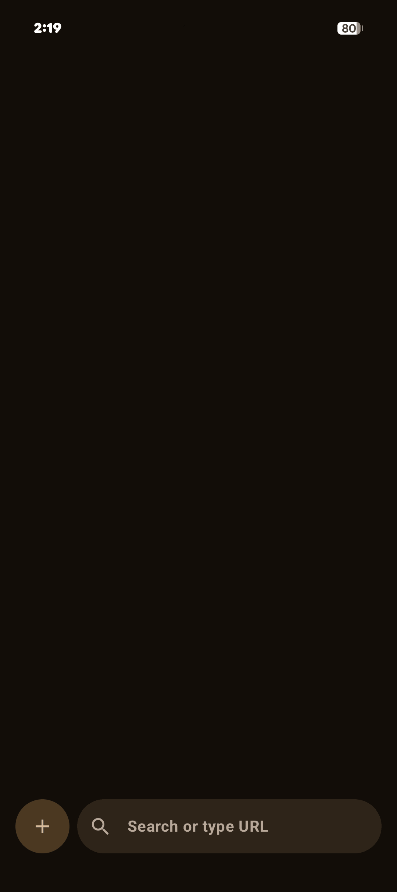
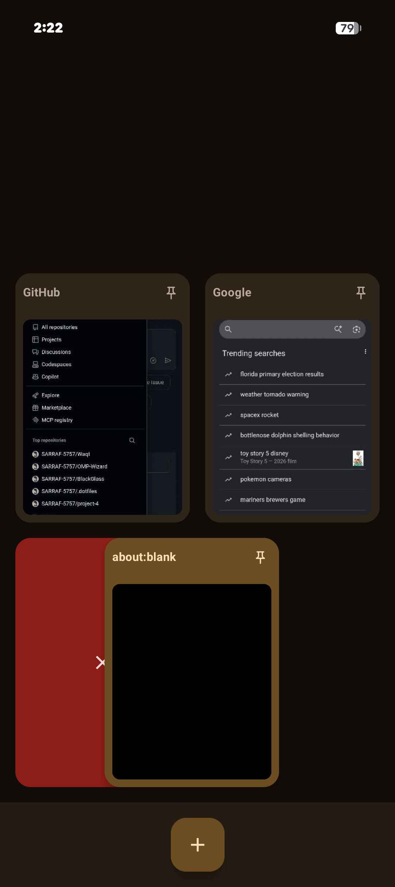
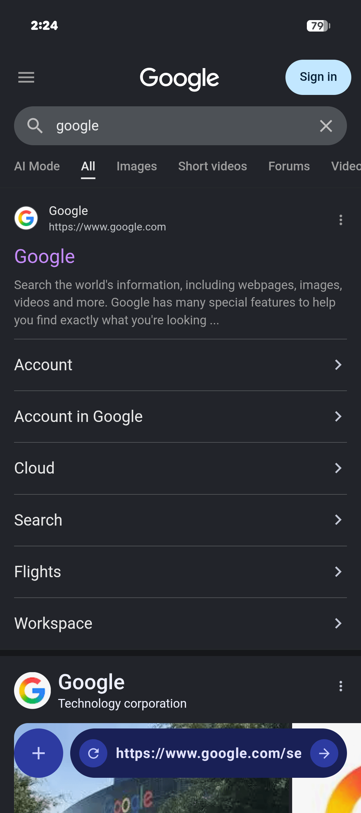
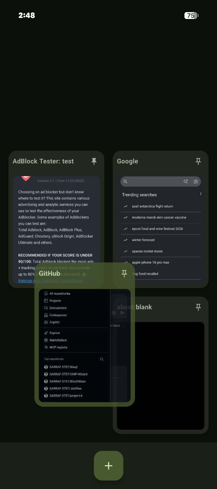
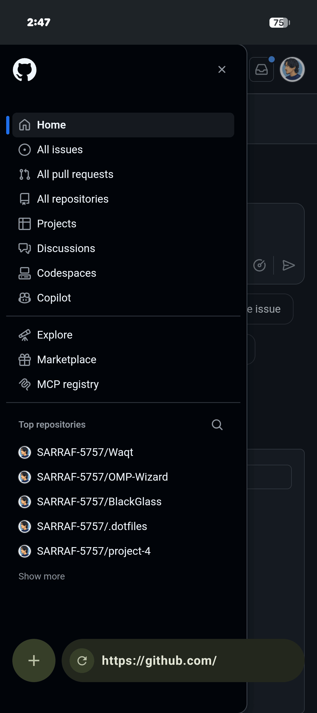

# Bare Browser

 

  

 

Bare Browser is a super lightweight (almost to a fault) browser. It's just android's WebView wrapped in some bare minimum Kotlin to provide basic UI and web browsing features.

## Features
- **One-Hand Operation Friendly Design**: Everything in the UI, starting from the URL bar to the tabs is stacked towards the bottom edge of the screen for easier reach- especially for bigger phones.
- **Material You Colors**: Full integration with Android's (12+) dynamic wallpaper-based theming system.
- **Tab Management**:
    - Swipe-up gesture to reveal a visual tab grid
    - Support for pinning essential tabs
    - Swipe right or left to dismiss/close tabs
    - Automatic restoration of tabs and session state upon app launch
- **Simple, built-in Ad blocker**: A simple adblock using [StevenBlack's Hosts List](https://github.com/StevenBlack/hosts) and CSS injection to remove visual artifacts (to be improved as I come across more ads while browsing)
- **Smooth Haptics**: Integrated haptic feedback for a nice, tactile browsing experience.
- **No Fuss**: Zero configuration, telemetries, or tracking. What you see is what you get. Only the essentials included to navigate the web. No extra buttons or menus.

## Tech Stack
- **Jetpack Compose**: For a fully declarative and modern UI.
- **Kotlin Coroutines & Flow**: Powering the linear, reactive state management.
- **Material 3**: Utilizing the latest Design System components.
- **Android System WebView**: Leveraging the robust and secure system browser engine.
- **Jetpack DataStore**: For session and configuration persistence.

## Motivation/Rant about mobile browsers
Why did I build it? Because I had a few simple criteria for a mobile browser. And I just couldn't find one browser that had all of them at the same time.
* A simple one-handed navigation method (bottom URL bar + tabs stacking from bottom up instead of up to down)
* A clean homepage without ads and news
* Has a built-in ad blocker, or has the ability to add one in.
* The *lack* of any features (such as firefox's incognito mode) that makes the browser screen hard to track for monitoring/parental control apps (ex. [Canopy](https://play.google.com/store/apps/details?id=com.canopy.vpn.filter), [Lock Me Out](https://play.google.com/store/apps/details?id=com.teqtic.lockmeout), etc).

So, instead of constantly browser-hopping and finding workarounds, I just decided to build one. However, the browser looks and functions only one way- my way. And I didn't feel the need to add a settings menu in since I built this only for myself. But if my browsing style happens to match yours, feel free to give Bare Browser a go!